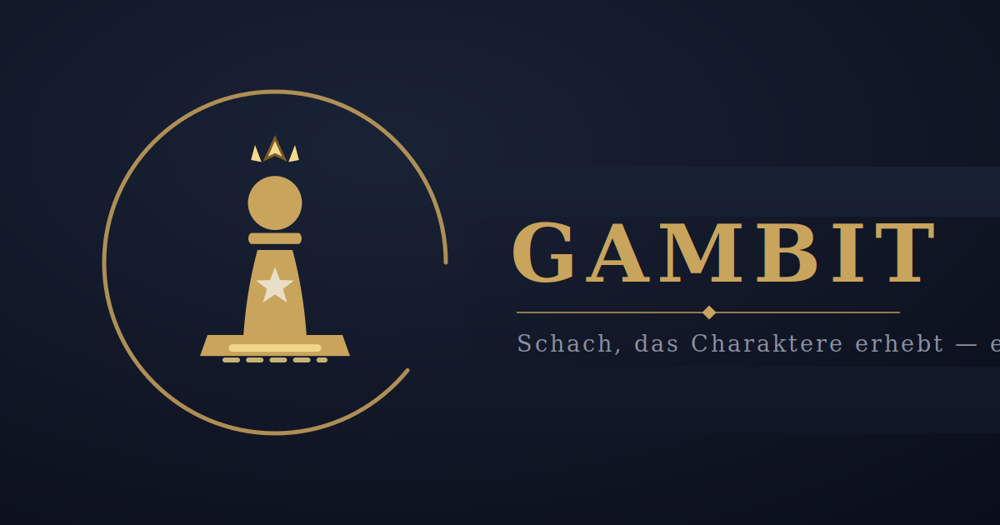
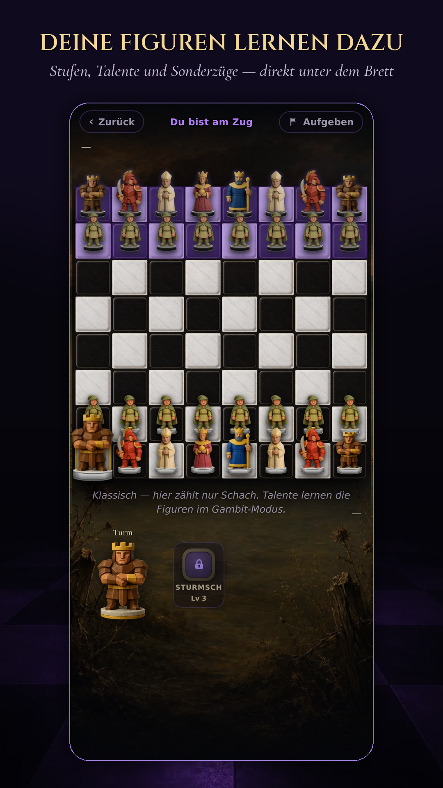
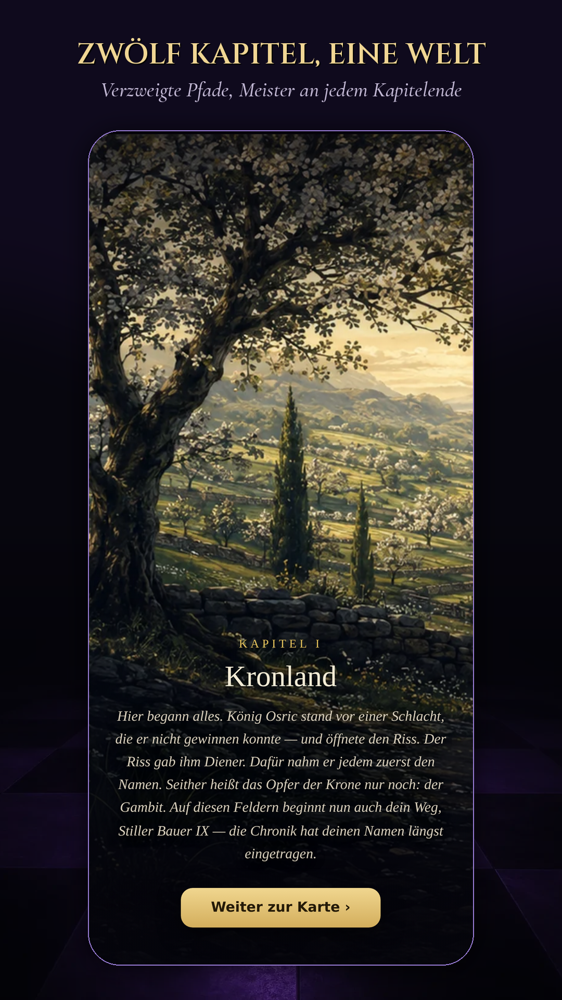
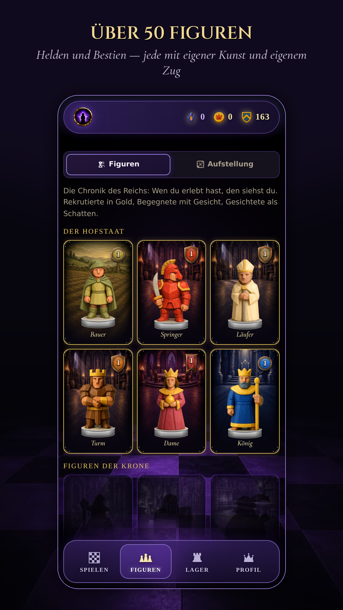
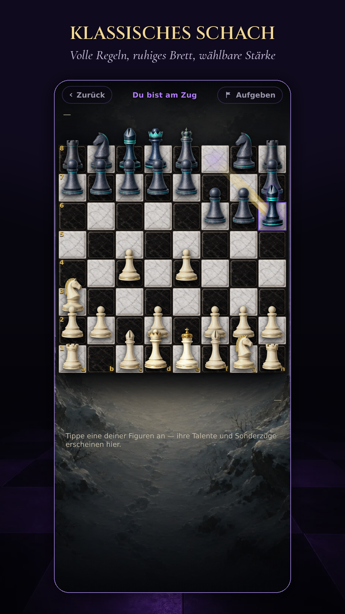

# ♟ Gambit Rise

[](https://gambitrise.com/)
[](https://github.com/manubloc/gambit-rise/actions)
[](CHANGELOG.md)

**Schach, das Charaktere erhebt.** Ein Taktik-Schach-RPG im Browser: Figuren
tragen Lebenspunkte, steigen im Rang auf und lernen echte Fähigkeiten — vom
Sturmschritt des Bauern bis zum Drachenflug. Besiegte Meister lassen sich
rekrutieren, und ein einziger Bauer trägt das Wappen, um das sich alles dreht.

**→ [gambitrise.com](https://gambitrise.com/)** · App unter
[/spielen/](https://gambitrise.com/spielen/) · kostenlos, ohne Werbung, ohne Käufe



## Was drin ist

| | |
|---|---|
| **Kampagne** | Zwölf Kapitel, 529 Stationen, verzweigte Pfade — jedes Kapitel ein eigenes Land, jeder Meister ein eigenes Duell |
| **Zwei Spielarten** | Klassisches Schach in voller Strenge — oder Gefechte mit Lebenspunkten, Fähigkeiten und Ausrüstung |
| **Hofstaat** | 27 rekrutierbare Helden, 25 Bestien, Fähigkeitenbäume, Ausrüstung, Sperren und Fallen |
| **Online** | Duelle gegen Freunde und Zufallsgegner, Fernpartien mit Benachrichtigung, zu zweit an einem Gerät |
| **Offline** | Die ganze Kampagne läuft ohne Internet |

<p align="center">
  
  
  
  
</p>

## Technik

**React 18 · Vite 5 · reines ESM · Node 22 · PWA**

Der Spielkern (`src/core`) ist UI-frei und deterministisch: eine
Command/Event-Simulation mit Replay. Dieselben Regeln laufen im Browser **und**
im Cloudflare-Worker der Online-Halle — eine Regeländerung gilt damit auf beiden
Seiten oder auf keiner.

```
src/core      Regeln, Simulation, KI          src/app       Schirme, Theme, i18n (DE/EN)
src/meta      Profil, Kampagne, Spielstände   src/content   Figuren, Fähigkeiten, Kapitel
src/platform  Speicher, Cloud                 worker/       Online-Halle (Durable Object)
```

Die Seite ist zweigeteilt: **`/`** ist das Schaufenster (`public/landing.html`),
**`/spielen/`** die App.

## Entwicklung

```bash
npm ci
npm run dev              # lokal spielen (http://localhost:5173)
npm test                 # volle Batterie — 28 Suiten / 2078 Prüfungen
npm run build            # Release-Bau → dist/
OHNE_ARCHIV=1 npm run build   # Zwischenstand ohne Archiv: 51 MB statt 743 MB
npm run build:single     # alles in EINER HTML-Datei
```

Lokal nötig: Node 22, `python3` mit Pillow (`npm test` misst Sockelfarben im
Bild) und Chromium für die Browser-Proben
(`npx playwright install chromium`, Pfad in `PW_CHROMIUM`).

**Vor jedem Push gilt die eiserne Kette** — Tests, alle drei Bauten,
Boot-Proben, Fahrprobe, Reinraum-Klon. Sie steht vollständig in
[CLAUDE.md](CLAUDE.md).

## Deployment

**Jeder Push auf `main` ist der Deploy.** Cloudflare Pages baut das Projekt und
den Worker `gg-hall` in zwei bis fünf Minuten. Abnahme:

```bash
curl -sL -H "Cache-Control: no-cache" https://gambitrise.com/spielen/version.json
```

Die Adresse trägt `/spielen/` — `version.json` zieht beim Bau mit der App um.

Keine Versions-Tags `v*` pushen: darauf feuert der itch.io-Workflow.

## Handbücher

- [CLAUDE.md](CLAUDE.md) — Arbeitsregeln, eiserne Kette, technische Fallen
- [CHANGELOG.md](CHANGELOG.md) — jede Fassung mit ihrer Ursache
- [design/PLAYSTORE.md](design/PLAYSTORE.md) · [design/PLAYSTORE-BACKLOG.md](design/PLAYSTORE-BACKLOG.md) — Store-Weg und offene Punkte
- [design/UEBERGABE-2026-09-27.md](design/UEBERGABE-2026-09-27.md) — Stand, Deploy-Weg, wo die Geheimnisse liegen
- [assets/README.md](assets/README.md) — Figuren und Karten-Bausteine als SVG

## Play Store

Die App ist eine TWA — eine dünne Android-Hülle um gambitrise.com. Paket
`com.gambitrise.app`, **noch nicht veröffentlicht**. Weil die Hülle nur die
Website zeigt, ist **jeder Push auf `main` zugleich das Store-Update**; eine
neue `.aab` braucht es nur, wenn sich die Hülle selbst ändert.

---

© 2026 — Alle Rechte vorbehalten. Siehe [LICENSE](LICENSE).
